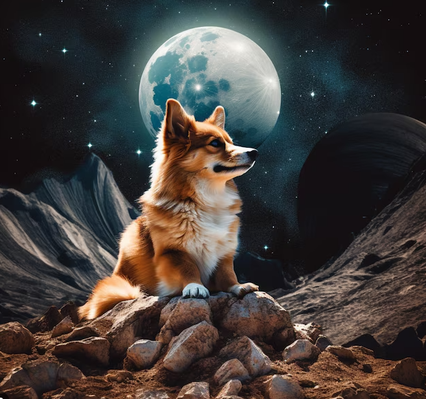
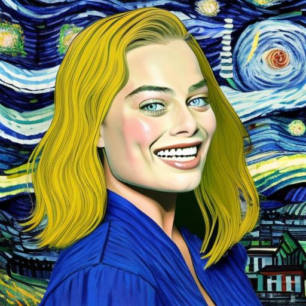
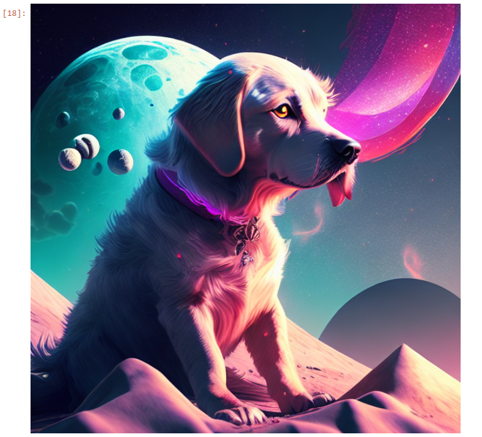
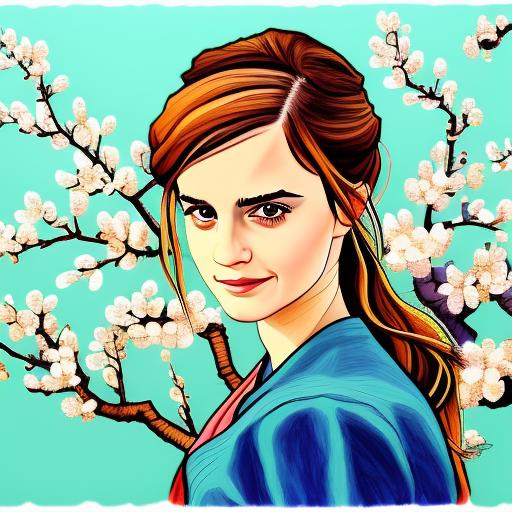

# IMATOR

IMATOR is a research-oriented Text-to-Image Generation project that explores multiple generative AI techniques for transforming natural language descriptions into images. The repository includes experiments with Generative Adversarial Networks (GANs), diffusion-based models, image filtering techniques, automatic prompt generation, and domain-specific fine-tuning workflows.

## Project Objectives

- Generate images from text prompts using modern deep learning approaches.
- Explore GAN-based image synthesis techniques.
- Experiment with diffusion model fine-tuning.
- Investigate automatic prompt generation workflows.
- Apply image processing and filtering techniques.
- Demonstrate practical applications of generative AI in visual content creation.

## Repository Structure

```text
IMATOR/
│
├── IMATOR.ipynb
├── GANOnMNIST.ipynb
├── diffusion_finetune_Ancient_Egyptians.ipynb
├── auto_prompting_using_BLIP_(1).ipynb
├── Filters.ipynb
├── Filters (1).ipynb
├── stackgans .ipynb
├── untitled3.py
│
├── Images/
│   ├── image1.png
│   ├── Image2.jpeg
│   ├── Image3.png
│   ├── Image4.jpeg
│   └── Imator.mp4
│
└── README.md
```

## Key Components

### Text-to-Image Generation
Implementation and experimentation with generative models capable of producing images from textual descriptions.

### GAN Experiments
Includes GAN-based image generation workflows and training experiments on benchmark datasets such as MNIST.

### Diffusion Model Fine-Tuning
Demonstrates the process of adapting diffusion models to specialized domains and custom datasets.

### Automatic Prompt Generation
Explores prompt generation techniques using vision-language models to improve image synthesis pipelines.

### Image Processing
Provides image filtering and enhancement experiments for preprocessing and postprocessing generated content.

## Technologies Used

- Python
- Jupyter Notebook
- PyTorch
- Deep Learning
- Generative Adversarial Networks (GANs)
- Diffusion Models
- Computer Vision
- Natural Language Processing

## Results

The repository contains generated samples and visual outputs demonstrating the effectiveness of the implemented generative models and image processing techniques.

## Future Improvements

- Improve image quality and resolution.
- Expand training datasets.
- Optimize inference performance.
- Integrate advanced diffusion architectures.
- Develop a user-friendly interface for prompt-based image generation.

## Author

Mohamed Ayman Elzoka

## License

This project is intended for educational, research, and experimentation purposes.


# Model Result 

#

#

#

